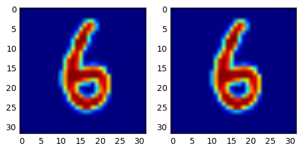
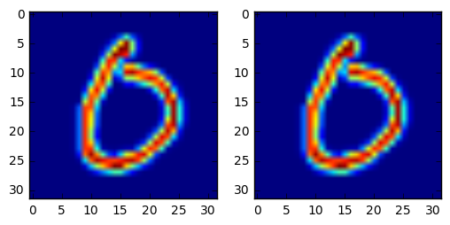
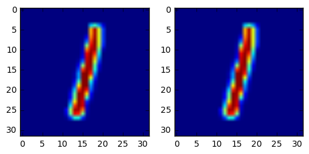

# Saak Transform 

This is a reimplementation of the paper **On Data-Driven Saak Transform** (https://arxiv.org/abs/1710.04176),  maintained by Jiali Duan and Yueru Chen.


psnr metric: 104.294772826



psnr metric: 105.637763477



psnr metric: 105.513759179



psnr metric: 106.509034118


### Table of Content

- [Dataset] ( Hand-written digits classification)
	* [MNIST] ( train set: 60000, 28x28. We used the same with downloaded from http://yann.lecun.com/exdb/mnist/)

- [Installation] (sklearn and Pytorch)
	* [Sklearn Installation] Refer to http://scikit-learn.org/stable/install.html)
	* [Pytorch Installation] (Refer to http://pytorch.org)
	* [Optional: Jupyter Notebook] (Refer to http://jupyter.org/install.html)

- [How to] (Forward and Inverse Transform
    * Command `python multi-stage_saak_v2.py`
	* Forward Transform: `multi_stage_saak_trans`
	* Inverse Transform: `toy_recon(outputs,filters)`
	* Detailed params:
```
usage: multi-stage_saak_v2.py [-h] [--loadSize LOADSIZE]
                              [--train_batch_size TRAIN_BATCH_SIZE]
                              [--test_batch_size TEST_BATCH_SIZE]
                              [--size SIZE] [--windsize WINDSIZE]
                              [--stride STRIDE] [--save_path SAVE_PATH]
                              [--recStage RECSTAGE] [--visNum VISNUM]
                              [--use_SP]

optional arguments:
  -h, --help            show this help message and exit
  --loadSize LOADSIZE   Number of samples to be loaded
  --train_batch_size TRAIN_BATCH_SIZE
                        Batch size for loading
  --test_batch_size TEST_BATCH_SIZE
                        Batch size for loading
  --size SIZE           Size of the input
  --windsize WINDSIZE   Size of moving window
  --stride STRIDE       Stride to take during convolution
  --save_path SAVE_PATH
                        Path to save result
  --recStage RECSTAGE   Reconstruction start stage
  --visNum VISNUM       Number of visualizations
  --use_SP              Use S/P conversion
```

- [To-do list]
	- [x] One-stage Saak Transform
	- [x] Multi-stage Saak Transform
	- [x] Inverse Transform
	- [x] S/P Conversion (multi-stage_saak_v2.py)
	```
	An alternative view about the Cascade of kernel augmentation and ReLU operation
	(5,-3) -> (5, 0, 0, 3)
	```

- [Other Code] 
	- [notebook] multi-stage_saak_v2.ipynb
	- [dataset I/O] datasets.py, utils.py

- [Contact Me](#Contact-me)


## Contact me

Jiali Duan (Email: jli.duan@gmail.com)

Yueru Chen (Email: yueruche@usc.edu)
